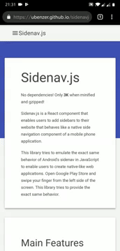

# Sidenav.js

No dependencies! Only *2K* when minified and gzipped!

Sidenav.js is a JavaScript library that enables users add sidebars to their web site that behaves
like a native side navigation component of a mobile phone application.


[Hi-res Video](https://www.youtube.com/watch?v=pLeKw-mBVyw&)

This library tries to emulate the exact same behavior of Android's sidenav in pure JavaScript to enable users
to create native-like web applications. Open Google Play Store and swipe your finger from the left of the
screen. This library tries to provide the exact same behaviour.

## Demo
To see a live demo click [here](https://rawgit.com/ubenzer/sidenavjs/master/demo/index.html) or scan the barcode at the end of the page. Don't forget to try it on your mobile phone too! Swipe your finger from the left of the screen towards right, just like you Open
a sidenav in Android!

## Features
1. Mobile first. Means: The library is small and robust, optimized for fluditly and framerate.
2. Multi-finger handled. Means: We won't confuse your fingers and throw bunch of exceptions if you
touch with more then one finger.
3. You can open/close sidenav programmatically. (Bind it to a button.)

## How to use
1. Include `sidenav.min.js` and `sidenav.min.css" in your proejct.
  ```html
  <link rel="stylesheet" href="sidenav.min.css">
  <script src="sidenav.min.js"></script>
  ```

2. Modify your html structure to conform to following:
  ```html
  <body>
    <div id="backdrop"><!-- If you want to put something into backdrop for some weird reason put here, otherwise   leave this empty. --></div>
    <div id="sidenav">
      Everything you want to be in sidenav goes here
    </div>
    <div id="content">
      All of the actual page content goes here
    </div>
    <script src="../dist/sidenav.min.js"></script>
    <script src="demo.js"></script>
  </body>
  ```

3. Initialize your sidenav like the following. As long as you provide single DOM element for each
configuration item, we don't care if you select them by id or anything else.
  ```javascript
  var sidenav = new Sidenav({
    content: document.getElementById("content"),
    sidenav: document.getElementById("sidenav"),
    backdrop: document.getElementById("backdrop")
  });
  ```
4. If you want to open/close sidenav programmatically (say, you have a hamburger menu button) attach
functionality like this:
  ```javascript
  document.getElementById("menu-toggle").addEventListener("click", function() {
    sidenav.open(); // or sidenav.close
  });
  ```

  `open()` and `close()` returns promise. This promise will be resolved once animations are complete
  and sidenav is fully opened/closed. So something like this will work:
  ```javascript
  document.getElementById("menu-toggle").addEventListener("click", function() {
    sidenav.open().then(function() { console.log("Hey! Sidenav is now open!"); });
  });
  ```

5. Profit!

## LICENSE
MIT

## TODO List
If you complete one of these and open a PR you are more than welcome! There are a lot of things, really.

0. Setup test structure
1. Add tests
2. Add better documentation
3. Publish on npm
4. Create a better demo
5. Enhance browser compatibility (adding a Promise shim is OK, I don't want to introduce a lot of shit to support old browsers)
6. Setup a web site
7. Use travis as CI
etc. etc.

## Contributing
Just open a PR and open a ticket.

## Credits
Partially inspired by [Slideout](https://github.com/Mango/slideout).

## Your barcode to the demo


